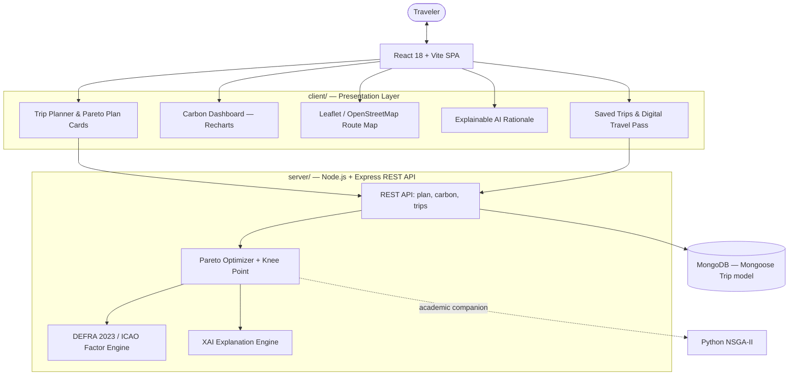

# EcoRoute — AI-Driven Sustainable Travel Planning Platform

[](https://www.mongodb.com/)
[](https://expressjs.com/)
[](https://react.dev/)
[](https://nodejs.org/)
[](https://opensource.org/licenses/MIT)

> **Engineering Design and Innovation (EDI) Group Project**  
> An AI-powered MERN-stack (MongoDB, Express, React, Node.js) sustainable travel planning platform integrating multi-objective carbon optimization, explainable AI, dynamic carbon footprint analytics, and interactive route mapping.

---

## 🌍 Abstract & Problem Statement
The rapid growth of the global tourism industry has significantly increased transportation-related carbon emissions. Existing commercial travel aggregators primarily optimize for cost and convenience while offering little to no visibility into the environmental consequences of choices in transportation, accommodation, and daily activities.

**EcoRoute** addresses this challenge by formulating travel itinerary generation as a **Multi-Objective Optimization Problem**, simultaneously balancing:
1. **Carbon Footprint ($\text{kg CO}_2\text{e}$)**
2. **Travel Cost ($\$$)**
3. **Travel Duration ($\text{hours}$)**
4. **User Preferences & Comfort**

---

## 🛠️ System Architecture (MERN)



| Layer | Tech |
| :--- | :--- |
| **M**ongoDB | Saved trips & travel passes (`server/src/models/Trip.js`, Mongoose). Falls back to an in-memory store if MongoDB is unreachable. |
| **E**xpress | REST API in `server/src/routes/api.js` |
| **R**eact | SPA in `client/` (Vite, React Router, Recharts, Leaflet, plain HTML/CSS/JS) |
| **N**ode.js | Optimizer, carbon calculator and XAI engine in `server/src/lib/` |

---

## 🔬 Mathematical Formulation

### 1. Objective Functions
Given a candidate itinerary $x \in \mathcal{X}$, the system solves:
$$\min f(x) = \left[ f_{\text{carbon}}(x),\ f_{\text{cost}}(x),\ f_{\text{time}}(x),\ -f_{\text{preference}}(x) \right]$$

- **$f_{\text{carbon}}(x)$**: Total greenhouse gas emissions calculated using standardized UK DEFRA (2023) and ICAO reporting factors:
  $$\text{Emission}_{\text{transit}} = \sum_{l \in \text{Legs}} d_l \times EF_{\text{mode}(l)} \times \text{Pax}$$
  $$\text{Emission}_{\text{stay}} = N_{\text{nights}} \times EF_{\text{hotel\_tier}}$$

- **$f_{\text{cost}}(x)$**: Total financial cost of transport, accommodation, and curated activities.
- **$f_{\text{time}}(x)$**: Cruising time + terminal overheads (e.g. check-in, security, transfers).
- **$f_{\text{preference}}(x)$**: Weighted alignment with traveler priorities (Eco, Speed, Budget, Balanced).

### 2. Standardized Emission Factors (DEFRA / ICAO)
| Mode / Asset | Emission Factor | Accounting Standard |
| :--- | :--- | :--- |
| **Electric High-Speed Rail** | `0.032 kg CO2e / pkm` | DEFRA 2023 Passenger Transit |
| **Electric Car (EV)** | `0.042 kg CO2e / km` | European Grid Electricity Average |
| **Express Coach / Bus** | `0.055 kg CO2e / pkm` | DEFRA 2023 Bus & Coach |
| **Average Petrol Car (ICE)** | `0.171 kg CO2e / km` | DEFRA 2023 Medium Car |
| **Domestic Flight** | `0.255 kg CO2e / pkm` | ICAO + 1.9x Radiative Forcing Index |
| **Eco-Certified Hotel** | `12.0 kg CO2e / room-night` | LEED / Green Key Benchmark |
| **Standard City Hotel** | `26.5 kg CO2e / room-night` | Global Hotel Decarbonisation Study |

### 3. Pareto Optimal Frontier & Knee Point
A candidate $A$ Pareto-dominates candidate $B$ ($A \prec B$) if $A$ is no worse than $B$ across all objectives and strictly superior in at least one. The solver extracts 3 hallmark solutions:
1. 🌿 **The Eco-Champion**: Absolute minimal carbon ($f_{\text{carbon}}$).
2. ⚡ **The Speed-Priority**: Minimal travel time ($f_{\text{time}}$).
3. ⚖️ **EcoRoute Optimal (Balanced)**: The **Knee Point** on the Pareto frontier that maximizes marginal emissions abatement per unit time/cost added (via normalized Euclidean distance to the Utopia point).

---

## 🚀 Quick Start Guide

### Prerequisites
- **Node.js** 18+ (20+ recommended)
- **MongoDB** 6+ running locally, or a MongoDB Atlas connection string (optional — without it the API uses an in-memory store)
- **Python** 3.9+ (optional, for the NSGA-II companion)

### 1. Install
```bash
npm run install:all
cp server/.env.example server/.env   # then edit MONGO_URI if needed
```

### 2. Develop (API on :5000, React on :5173 with /api proxied)
```bash
npm run dev
```
Open http://localhost:5173

### 3. Production build (Express serves the built React app)
```bash
npm run build
npm start          # http://localhost:5000
```

### 4. Tests
```bash
npm test
```

### REST API
| Method | Endpoint | Description |
| :--- | :--- | :--- |
| GET | `/api/health` | Status and active database (`mongodb` / `in-memory`) |
| GET | `/api/cities?q=` | City catalogue |
| GET | `/api/factors` | DEFRA / ICAO emission factors |
| POST | `/api/plan` | Multi-objective optimisation → 3 Pareto plans + all candidates |
| POST | `/api/carbon` | Stand-alone footprint calculator |
| GET / POST | `/api/trips` | List / save trips (returns a `passCode`) |
| GET / PATCH / DELETE | `/api/trips/:idOrPassCode` | Read, switch plan, or delete a trip |

Example:
```bash
curl -X POST localhost:5000/api/plan -H 'Content-Type: application/json' \
  -d '{"origin":"paris","destination":"amsterdam","startDate":"2026-10-10","endDate":"2026-10-13","travelers":2,"budget":1200,"priority":"eco","preferredModes":["train","flight"]}'
```

### Python NSGA-II Optimizer (optional)
```bash
python3 python-optimizer/nsga2_optimizer.py
```

---

## 📂 Project Structure

```
├── package.json            # root scripts (install:all, dev, build, start, test)
├── server/                 # Node.js + Express + MongoDB
│   ├── src/index.js        # entry point (connects DB, starts server)
│   ├── src/app.js          # Express app, serves client/dist in production
│   ├── src/db.js           # Mongoose connection
│   ├── src/store.js        # Trip repository (MongoDB or in-memory fallback)
│   ├── src/models/Trip.js  # Mongoose schema
│   ├── src/routes/api.js   # REST endpoints
│   ├── src/lib/            # factors, calculator, destinations, optimizer, explain
│   └── test/               # node:test API tests
├── client/                 # React + Vite (JavaScript, plain CSS)
│   ├── index.html
│   └── src/
│       ├── pages/          # Home, Planner, Dashboard, MyTrips, TripPass
│       ├── components/     # TripForm, PlanCards, CarbonCharts, RouteMap, DayTimeline, ExplainCard, TravelPass
│       ├── api/client.js   # fetch wrapper
│       └── index.css       # design system
└── python-optimizer/       # NSGA-II academic companion
```

---

## 💡 Key Features Implemented

1. **Intelligent Itinerary Generator**:
   - Customizable origin, destination, trip dates, traveler count, and budget.
   - Dynamic scheduling of certified eco-hotels and low-impact cultural/outdoor attractions.
2. **Multi-Objective Pareto Engine**:
   - Extracts non-dominated candidate routes across emissions, cost, and time.
   - Provides 3 comparative choices: **🌿 The Eco-Champion**, **⚖️ EcoRoute Optimal**, and **⚡ Speed-Priority**.
3. **Dynamic Carbon Dashboard**:
   - Visual breakdown of emissions (Transport vs Accommodation vs Activities).
   - Comparison against conventional unoptimized baseline (Aviation + 4-Star Hotel).
   - Conversion to **Annual Tree Sequestration Equivalents** (21.77 kg $\text{CO}_2$/year per mature tree).
4. **Interactive Route Mapping**:
   - Clean OpenStreetMap CartoDB rendering with Leaflet.
6. **Saved Trips & Digital Travel Pass (MongoDB)**:
   - Save any plan, get a unique pass code, switch plans later, look passes up by code.
   - Dynamic route polyline styling based on mode (solid emerald for train, dashed rose for flight, cyan for EV).
   - Interactive popups for origins, destinations, and scheduled attractions.
5. **Explainable AI (XAI)**:
   - Transparent natural-language justifications.
   - Quantified carbon and time trade-offs for each candidate leg.
   - Behavioral eco-nudges (packing light, public bike shares, zero single-use plastic).

---

## 📜 Authors & Acknowledgments
Developed as an **Engineering Design and Innovation (EDI)** project. Designed to advance sustainable computing and green tourism through applied AI and multi-objective evolutionary computation.
